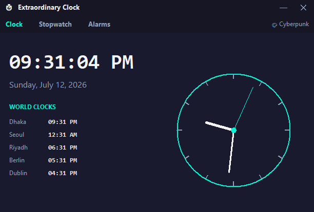

# Extraordinary Digital Clock

A desktop clock application built with Python and Tkinter — going well beyond a
basic `datetime` + `Label` tutorial project into a small multi-feature desktop
app with real UI/UX and software design decisions behind it.



## Features

- **Custom window chrome** — borderless, draggable window with its own
  minimize/close controls instead of relying on the OS title bar.
- **Time-of-day reactive background** — the gradient shifts color palette
  depending on the current hour (day tones vs. night tones), recalculated
  every 30 seconds.
- **Digital + analog display** — a live analog clock face is drawn on a
  `Canvas` using trigonometry for the hour/minute/second hands, alongside the
  standard digital readout and full date.
- **World clock panel** — five configurable timezones (Dhaka, Seoul, Riyadh,
  Berlin, Dublin by default) shown as fixed UTC offsets, updating live
  alongside the local clock.
- **Theme switcher** — three built-in themes (Cyberpunk, Minimal Light, Old
  Money) swappable instantly via a click, no restart required.
- **Stopwatch** — start/stop/lap/reset, with a scrolling lap history.
- **Alarms** — set multiple labeled alarms; a popup and audible beep fire
  when one is triggered.
- **Persistent settings** — last-used theme, window position, and active
  mode are saved to `settings.json` and restored on the next launch.

## Why this project (design notes)

This was deliberately built with a class-based architecture
(`DigitalClockApp`) rather than flat procedural script logic, to demonstrate:

- Encapsulation of state (theme, alarms, stopwatch) inside a single object
  rather than scattered globals.
- Correct use of Tkinter's event-driven model — `.after()` for scheduled
  updates instead of blocking loops, which is the single most common mistake
  beginners make with GUI programming in Python.
- Basic 2D geometry/trigonometry applied to a real rendering problem (the
  analog clock hands).
- File I/O and state persistence via JSON, mirroring how real desktop apps
  remember user preferences.

## Requirements

- Python 3.8 or later
- Tkinter (bundled with most Python installations; on Ubuntu/Debian, install
  via `sudo apt install python3-tk` if it's missing)
- `winsound` is used for the alarm beep on Windows automatically; on macOS/
  Linux the app falls back to a terminal bell instead of crashing.

No third-party packages are required — everything here uses the Python
standard library. World clock times use fixed UTC offsets rather than a
timezone database, so no `tzdata` install is needed. The trade-off: offsets
are hardcoded to each city's current standard, so they will be off by an
hour during daylight saving time transitions until manually updated in
`WORLD_CLOCK_OFFSETS` at the top of the file.

## Running it

```bash
python Digital_Clock.py
```

The window remembers its last position and theme between runs via
`settings.json`, which is created automatically next to the script on first
launch. This file is user-specific runtime state, not source code — it's
listed in `.gitignore` so it won't be committed to the repository.

## Controls

- **Drag** the title bar (or anywhere on the background) to move the window.
- Click **Clock / Stopwatch / Alarms** tabs to switch modes.
- Click the **🎨 theme name** in the top-right of the tab bar to cycle themes.
- Press **Esc** or click **✕** to close the app.

## Possible future additions

- Automatic daylight saving time adjustment for world clock offsets
- Weather integration via a free API alongside the time
- Offline text-to-speech time announcements
- A Pomodoro/focus-session mode built on top of the stopwatch logic
- Custom user-added timezones via the UI (currently edited via the
  `WORLD_CLOCK_OFFSETS` dictionary in the source file)

## License

MIT — feel free to fork and build on this.
